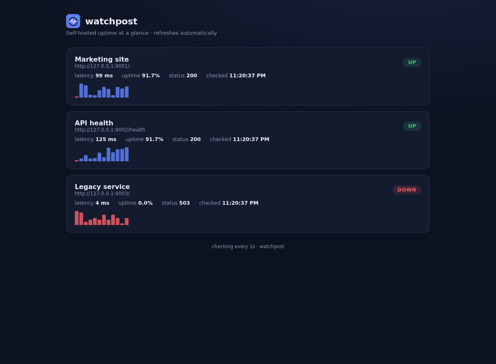

<p align="center">
  
</p>

# watchpost

A tiny self-hosted uptime monitor. One binary, no database, no agents, no monthly fee — point it at your endpoints and open the dashboard.



## Who it's for

Indie developers, freelancers, and small teams who run a handful of sites or APIs and want to know they're up without paying for a hosted monitoring service or standing up a heavyweight stack.

## Quick start

```bash
go build -o watchpost .

cat > watchpost.json <<'JSON'
{
  "targets": [
    { "name": "My site", "url": "https://example.com" },
    { "name": "API", "url": "https://api.example.com/health" }
  ]
}
JSON

./watchpost -config watchpost.json -interval 30s -addr :8080
```

Then open `http://localhost:8080`.

## Features

- **Single static binary** — Go standard library only, no dependencies, deploys anywhere
- **Live dashboard** — UP/DOWN pills, latency, rolling uptime %, and a latency sparkline per target, auto-refreshing every 5 seconds
- **JSON API** — `GET /api/status` returns everything the dashboard shows, ready for your own alerting or status page
- **Concurrent checks** — all targets checked in parallel on your chosen interval
- **Rolling history** — last 60 checks kept in memory per target
- **Graceful shutdown** — Ctrl-C cleanly stops the server and checker

## Flags

| Flag | Default | Meaning |
|------|---------|---------|
| `-config` | `watchpost.json` | Path to the targets file |
| `-interval` | `30s` | Time between check rounds |
| `-addr` | `:8080` | Dashboard listen address |

## Tests

```bash
go test ./...
```

Covers up/down detection, history trimming, and unreachable hosts.

## Tech

Go 1.22, standard library only. The dashboard is a single embedded HTML file; the logo is an original SVG mark made for this project.
